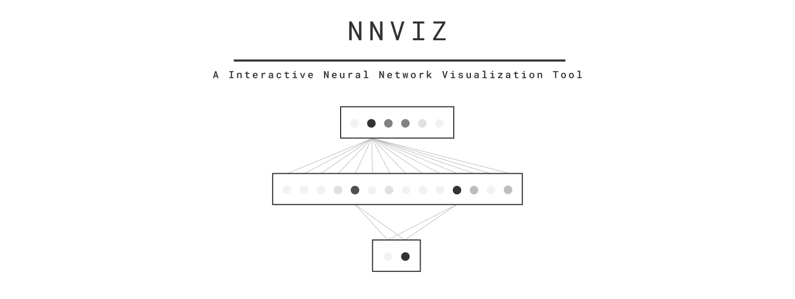

### How to use

`To run NNVIZ on your trained network you need to create a config.py. Then run nnviz server in the same directory as config.py`

`Example config.py`

```python
"""
Config file for nnviz
"""

from nnviz.utils import * # Necessary for using nnviz utilities.

import numpy as np 
import tensorflow as tf 

from tensorflow.keras.models import model_from_json
from os import path as pathlib


model_path = pathlib.abspath("./examples/notebooks/saved_model/mnist_dense_diff.json")
weights_path = pathlib.abspath("./examples/notebooks/saved_model/mnist_dense_diff")

"""
Data Prep
"""

(x,y),(_,_) = tf.keras.datasets.mnist.load_data() # Load dataset
x = x.astype(np.float32).reshape(-1,784) # Prepare for input

# This will be used for setting outputs.

input_config = {
    "examples":[ # Look at input_examples for detailed explaination
        {
            "name":f"ex_{i}_class_{str(y[i])}",
            "input":{ 
                "value":x[i:i+1],
            },
            "output":str(y[i])
        }
        for i in np.random.randint(0,len(x),20)
    ],
    "input_layers_config":{ # Look at input_layers_config for detailed explaination
        "input":{
            "type":"image",
            "shape":(28,28),
            "transformer":"prepare_input_image",
            "resize":(128,128)
        }
    },
    "input_nodes":['input'] # Look at input_nodes for detailed explaination
}

model = model_from_json(open(model_path,"r").read()) # Create model from 
model.load_weights(weights_path)

```

\* API is not fully functioning yet.

### To Do

1. ` Add different input types`
2. ` Create a service sidebar`
3. ` Customizable Network UI`


### Input Templates / Types

`1. Image` 

    Input   : Image with shape ( h,w,c ) for RGB images, (h,w) for greyscale images.
    Renders : 128x128 Image 

`2. Row`

    Input   : A list of tuples containing column name and column value.
    Renders : A table