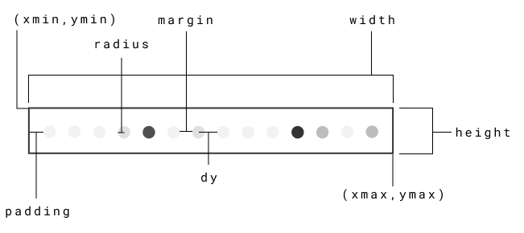
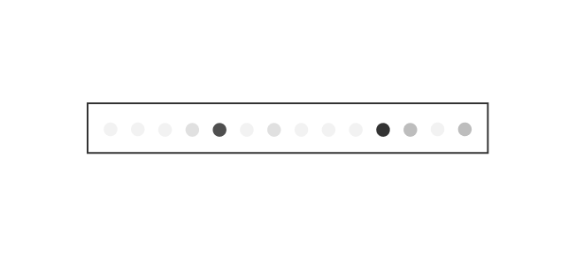

### ```class Dense```
`tensorflow.keras.layers.Dense`

`args`:
```js
{
    data:{
        class_name: "Dense", // Name of the layer class  
        inbound: [], // List of inbound nodes
        outbound: [], // List of outbound nodes
        outputs: [], // List of outputs -> shape ( 1,n ) where n is number of units
        level: 0 // Level in hierarchical representation
    }, 
    ctx :CanvasRenderingContext2D, // Canvas Rendering Context 
    name:"Dense", // Name of the layer 
    network:{} // Network config
}
```

`methods` 

1. calculateWidth -> int : calculates, stores and returns width using config.  
2. calculateHeight -> int : calculates, stores and returns height using config.  
3. render -> undefined : renders layer on canvas.

`config`

```js
{
    radius: 3,
    margin: 6,
    height: 0,
    width: 0,
    xmin:0,
    ymin:0,
    xmax:0,
    ymax:0,
    dy:0
}
```



`example render`

